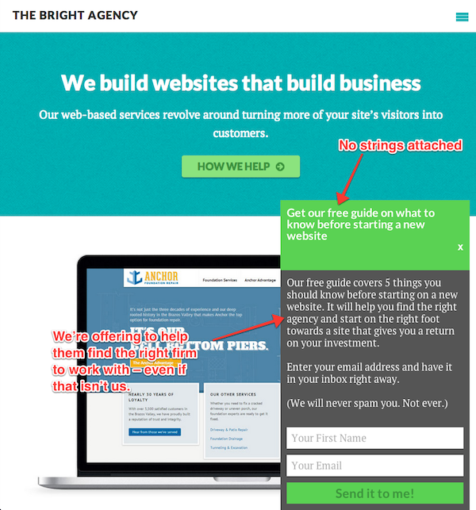

### One percent at a time

Yesterday morning I saw Tyler Young's post [Marketing Your Small Business in 2 Hours a Day](http://conversioninsights.net/marketing-small-business-2-hours-a-day/ "Marketing Your Small Business in 2 Hours a Day"). It's a great post, and you should go read it. Towards the beginning, he introduces an idea that has really stuck with me as a simple, yet powerful, framework for improving your business. That idea is Alan Weiss' "One Percent Solution". Simply put, if you improve your business by one percent each day, **in 70 days you will have improved it by 100%**. Granted, you could start picking that concept apart and arguing that it's not possible/sustainable, but that would be missing the point entirely. The whole idea is to shift your thinking from "I need to make my business way better", which for many people induces panic and fear, to "I just need to do one thing better today", which is **completely and totally** achievable, each and every day.

Not sure where to start? Read on.

### Charge more

This is true: **you probably don't charge enough money**. Some of you reading this might charge enough, but chances are you don't. To rectify that, go buy my friend Brennan's [_Double Your Freelancing Rate_](http://doubleyourfreelancingrate.com/ "Double Your Freelancing Rate") and read it. It's $49 and worth every penny, and if you use the promo code "TNORTH" you'll get 20% off. I don't get any affiliate commission on that, by the way – I just asked Brennan for a promo code to share with you. This book is great if you're still charging a fairly low hourly rate for design, development, copywriting, consulting, etc. I'd classify anything under $50 per hour as "go buy this book and implement its advice tomorrow" low, but of course as with everything, it depends on the circumstances. However, **do not** use that as an excuse to convince yourself that your situation is a special case and you can't justify charging more for the value you provide! Even if you're charging more than that now, you can still probably benefit from the book. My partner [Michael](http://elsteele.com "Michael's blog") and I raised our rates from $75 per hour to $100-150 per hour (depending on the client and type of work) after implementing Brennan's advice.

### Charge for your value, not for your time

I just said we raised our rates to \$100-150 per hour, right? Well, the truth is, we only charge by the hour for small, one off tasks. For our typical projects, we (try to) **charge for the value we provide**, not for the time we work. Why? The better we get at what we do, the faster we do it (for most things). If we charged an hourly rate, we'd be penalizing ourselves for getting faster! Sure, we'd have more time to churn through more projects, but we'd still be artificially limiting ourselves – there are only so many hours in a day. Instead, we try to charge our clients based on the value we provide to them. We'd rather work on fewer high-value (and high-dollar) projects and do work that is more interesting and more fulfilling than churn out a river of projects as fast as we can. That's not to say there's anything wrong with that model, it's just not what we want to do. Of course, this means that we're not interested in taking on every project. Some prospects just don't emotionally or institutionally value what we do enough to pay what we would charge them.

Even though the title of Brennan's book suggests it's only for time-based pricing models, the content is actually extremely relevant if you want to learn how to charge for the value you provide. I'd also recommend [_Breaking the Time Barrier_](http://breakingthetimebarrier.freshbooks.com/ "Breaking the Time Barrier"), by Mike McDerment (CEO of Freshbooks). It's a very quick read, and free/name your own price to boot! One more book to check out is [_Value-Based Fees_](http://www.amazon.com/gp/product/B0062O8UBY/ref=as_li_ss_tl?ie=UTF8&camp=1789&creative=390957&creativeASIN=B0062O8UBY&linkCode=as2&tag=travinorth-20 "Value-Based Fees on Amazon"), by Alan Weiss. I can't give that one my full endorsement yet, as I haven't read the whole thing. However, at the very least there is some good advice in it.

### ~~Blog~~ Write more

Nathan Barry is a far greater authority on this topic than I am, so I'll let [his post](http://nathanbarry.com/365/ "Three Hundred Sixty Five") extoll the benefits of writing more:

> Looking at my business revenue from the last 365 days, I decided to filter it down to just revenue I could trace back in some way to my writing habit (which is almost all of it): \$249,602 (before expenses). That’s insane.
>
> Most of that is from book sales, and the rest is from two small contract writing projects I did. Divide that number by 365,000 words and you get $0.68 per word written or $683 per day. That’s an incredible return on investment.

In 2012, Nathan started a habit of writing a thousand words for every day. Some days he wrote nothing, and other days he wrote more than a thousand words to make up for the nothing days. Sometimes he didn't write, but made videos or recorded audio, which he counted at roughly one hour of work = one thousand words. The point is, he established a solid habit of **creating** nearly every single day. Sometimes it was blog posts, other times writing for various books he sold, etc. I'm obviously nowhere near that level (yet!), but I'm working on it. [Michael](http://elsteele.com "El Steele") and I are doing a challenge for the month of November to write 500 words every weekday, whether that's on our personal sites, our [business blog](http://brightagency.net/blog "The Bright Agency blog"), or email [newsletters](http://brightagency.net/newsletter "The Bright Agency newsletter") and [courses](http://brightagency.net/optimization-course/ "Conversion Optimization Course") for our business. That doesn't sound like much, but even a little bit adds up over time; by the end of the month we'll have written over 20,000 words combined, and that's just in one month.

### Set up lifecycle/sales funnel emails

I mentioned above that we're working on some email courses for our business. Well, I think you should be doing that too. The idea here is that when potential clients arrive on your site, you should offer them something of value right away. What if they're not quite ready to contact you? Maybe they're just thinking about redesigning their site, but don't want to deal with a high-pressure sales process. Why not offer them some helpful information, in exchange for their email address? On our site, we offer "5 things you need to know before starting on a new website".  They enter their email address, and we send it off to them, and can then follow up after a few days to see what questions they have. This is a pretty basic example, since we only have one automated email that goes out. We also have [another course](http://brightagency.net/optimization-course/ "Optimization Course") focused on improvements they can make to their website right now. That one is five emails sent out over eleven days, with a follow up after a couple of weeks to see how implementation is going. That follow up is the perfect time to start making a sale, because if it's been two weeks and they haven't implemented any of the small suggestions we've made, chances are they won't ever get around to it, and they know that. At that point, we can talk more about doing this (and more complex stuff, too) for them.

Resources for setting this up:

- [Drip](https://www.getdrip.com/ "Drip")
- [ConvertKit](https://convertkit.com/ "ConvertKit")
- Roll your own with [Customer.io](http://customer.io "Customer.io") (this is what we're doing, for the extra flexibility)

### Teach

I wrote a post last week about [the power of teaching](http://travisnorthcutt.com/the-power-of-teaching/ "The Power of Teaching") as a way to win more (and better) business. Besides just writing more blog posts and email courses, you could also do in-person training/teaching. This isn't something I've done yet, although it is something we're planning on doing in the near future. However, Tyler Young has an [excellent post](http://planscope.io/blog/how-i-made-312-50-an-hour-teaching-local-business-owners/ "Teaching business owners") on his experience with this on the Plancsope blog. I highly recommend reading that.

### What are you going to do?

I've presented five different things you can do to improve your business, and of course there are countless others. However, the best way to start is to choose **just one thing** and make it your priority for tomorrow. What one thing are you going to improve in your business? Post a comment and share, and feel free to ask questions if you have any. I'd love to help you get 1% better.
